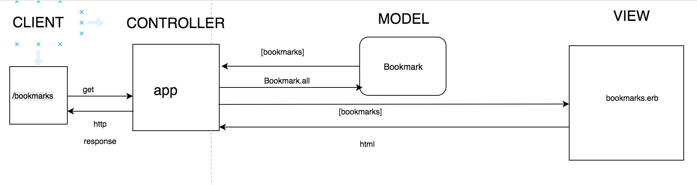

Description
-------

Installation
-------

* PostgresSQL installed and configured 

Database Configuration
-------

$ `psql` 
=# `CREATE DATABASE bookmark_manager;`
=# `\l` to ensure that db has been created 
=# `\c bookmark_manager` to connected to db
<!-- bookmark_manager=# `CREATE TABLE bookmarks (id serial PRIMARY KEY, url VARCHAR(60));` 
bookmark_manager=# `INSERT INTO bookmarks(url) VALUES ('INSERT URL HERE');` add as many url to your db table -->

Datamapper_setup.rb will allow url inputed by the user to persist in the database that is created

User Stories 
-------
```
As a user
In order to find my saved websites quickly
I want to see a list of bookmarks 

As a time-pressed user
So that I can save a website
I would like to add the site's address and title to bookmark manager
```

Domain Model
-------



 <a href='http://<%= bm.url %>'><%= bm.url %></a> 


